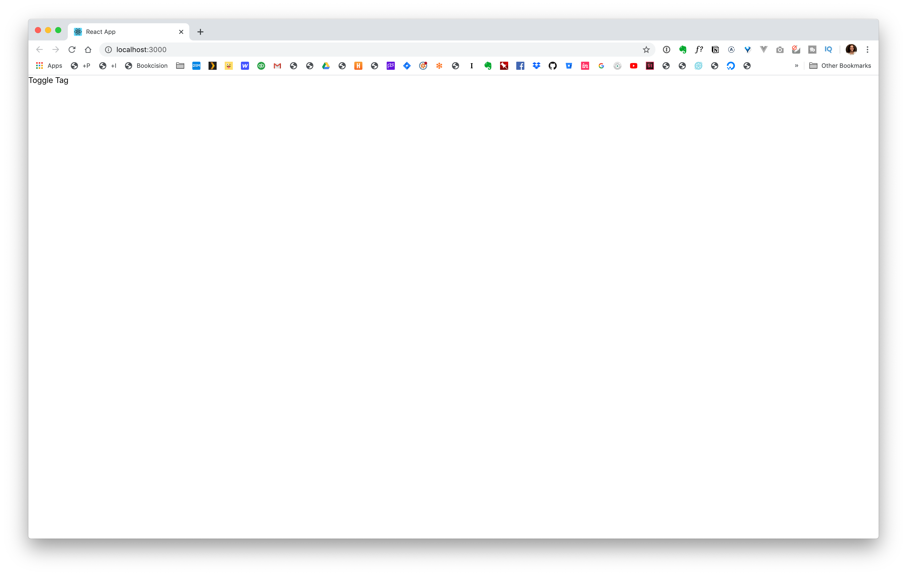

<script>
  import ButtonLink from "$components/shared/ButtonLink.svelte"
</script>

<ButtonLink>Yolo</ButtonLink>

Last week, I was working on a project and wrote the frontend code for togglable, tag component in React that I was particularly proud of. — you know, that feeling when you get something to work in code and you think, "I'm a genius!" Let's build it!

Here's a look at the final product:

<!-- TODO: Could include an interactive component / CODEPEN  -->


It's a list of grade levels K - 12. The user can click on any of these items to toggle them or toggle them on or off.

Cool. So, let's jump into the code!

Since this is a React component, let's start by using **Create React App**.

```sh
npx create-react-app toggle-grades
```

This will take a hot minute.

Sweet.

Now, let's go into our new project folder:

```sh
cd toggle-grades
```

and let's start our project:

```sh
yarn start
```

I'm going to create a file called **ToggleTag.js**

Within the new file, I'm going to type `rafc` . This is a snippet that I've set up inside VS Code that will expand to give you a **functional react component.** I'll include a link to the package in the description below.

```js
import React from 'react';

const ToggleTag = () => {
  return <div>Toggle Tag</div>;
};

export { ToggleTag };
```

We'll name our component ToggleTag and make this a named export.

In fact, one of the things I like to do with all my react components is make them named exports. This consistency helps prevent errors in the future. I don't have to think about whether something is a default export or a named export when everything is a named export. I just know.

I'm going to add the word "Toggle Tag" inside the component, just so we know everything is working.

```js
import React from 'react';

const ToggleTag = () => {
  return <div>Toggle Tag</div>;
};

export { ToggleTag };
```

Now, I'm going to jump over to **App.js** and delete a lot of the code that's already in there.

I'm going to import the `ToggleTag` component that we just created and add it it our render.

```js
import React from 'react';
import logo from './logo.svg';
import './App.css';

import { ToggleTag } from './ToggleTag';

function App() {
  return (
    <div className="App">
      <ToggleTag />
    </div>
  );
}

export default App;
```

I'm going to give it a save and a refresh and you should see our **ToggleTag** text.


